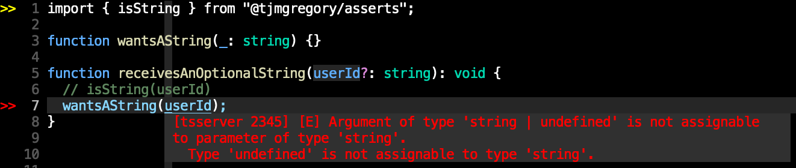
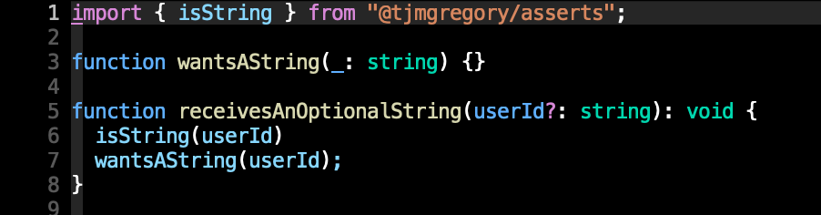

<p align="center">
  <a href="https://github.com/tjmgregory/asserts">
    
  </a>
</p>

<p align="right">
  <i>If you use this repo, star it ✨</i>
</p>

---

<p align="center">👻 <b>Comprehensive collection of type assertions for JavaScript and TypeScript</b></p>

<p align="center">
  Forked from <a href="https://github.com/sniptt-official/guards" target="_blank">@sniptt/guards</a>
</p>

<p align="center">
  <b>Zero dependencies</b> 💪
</p>

---

## Install

### Node.js and the browser

```sh
npm install @tjmgregory/asserts
```

### Deno

```typescript
import { ... } from 'https://deno.land/x/asserts/mod.ts'

// TODO
```

## Why the fork?

[@sniptt/guards](https://github.com/sniptt-official/guards) allows you to infer your types via `if` statements.

asserts enables this same type inference, but without `if` statements, instead by informing the compiler that we will throw if this value is not of this type, so you know for certain that it is.






## Usage

### Foreword on JavaScript data types and data structures

The latest ECMAScript standard defines nine types:

- Six **Data Types** that are primitives, checked by `typeof` operator:
  - `undefined`: `typeof instance === "undefined"`
  - `Boolean`: `typeof instance === "boolean"`
  - `Number`: `typeof instance === "number"`
  - `String`: `typeof instance === "string"`
  - `BigInt`: `typeof instance === "bigint"`
  - `Symbol`: `typeof instance === "symbol"`
- **Structural Types**:
  - `Object`: `typeof instance === "object"`. Special non-data but structural type for any constructed object instance also used as data structures: new `Object`, new `Array`, new `Map`, new `Set`, new `WeakMap`, new `WeakSet`, new `Date` and almost everything made with `new` keyword;
  - `Function` non data structure, though it also answers for `typeof` operator: `typeof instance === "function"`. This answer is done as a special shorthand for `Function`s, though every `Function` constructor is derived from `Object` constructor.
- **Structural Root** Primitive
  - `null`: `typeof instance === "object"`. Special primitive type having additional usage for it's value: if object is not inherited, then `null` is shown;

Source: <https://developer.mozilla.org/en-US/docs/Web/JavaScript/Data_structures>

### Primitives

Sample usage:

```typescript
import { primitives } from '@tjmgregory/asserts';

primitives.isNumber(val);
```

or

```typescript
import { isNumber } from '@tjmgregory/asserts';

isNumber(val);
```

#### `isBigInt`

```typescript
import { isBigInt } from '@tjmgregory/asserts';

let val: bigint | number;

function wantsABigint(foo: bigint) {}

isBigInt(val);
// TypeScript will infer val is now a bigint, else it would have thrown
wantsABigint(val); // Compiles
```

#### `isBoolean`

```typescript
import { isBoolean } from '@tjmgregory/asserts';

let val: boolean | number;

function wantsABoolean(foo: boolean) {}

isBoolean(val);
// TypeScript will infer val is now a boolean, else it would have thrown
wantsABoolean(val); // Compiles
```

#### `isNumber`

Throws for `NaN`!

See also:

- [isNumberOrNaN](#isnumberornan)
- [isInteger](#isinteger)
- [isBigInt](#isbigint)

```typescript
import { isNumber } from '@tjmgregory/asserts';

let val: number | string;

function wantsANumber(foo: number) {}

isNumber(val);
// TypeScript will infer val is now a number, else it would have thrown
wantsANumber(val); // Compiles
```

#### `isString`

```typescript
import { isString } from '@tjmgregory/asserts';

let val: string | number;

function wantsAString(foo: string) {}

isString(val);
// TypeScript will infer val is now a string, else it would have thrown
wantsAString(val); // Compiles
```

#### `isSymbol`

```typescript
import { isSymbol } from '@tjmgregory/asserts';

let val: symbol | string;

function wantsASymbol(foo: symbol) {}

isSymbol(val);
// TypeScript will infer val is now a symbol, else it would have thrown
wantsASymbol(val); // Compiles
```

#### `isUndefined`

```typescript
import { isUndefined } from '@tjmgregory/asserts';

let val: undefined | null;

function wantsUndefined(foo: undefined) {}

isUndefined(val);
// TypeScript will infer val is now a undefined, else it would have thrown
wantsUndefined(val); // Compiles
```

### Structural

Sample usage:

```typescript
import { structural } from '@tjmgregory/asserts';

structural.isMap(val);
```

or

```typescript
import { isMap } from '@tjmgregory/asserts';

isMap(val);
```

#### `isNull`

Answers `true` if and only if `value === null`.

#### `isFunction`

Answers `true` if and only if `typeof value === "function"`.

#### `isObject`

Answers `false` to `null`!

To check for array:

```typescript
isArray(term);
```

To check for object _or_ null:

```typescript
isObjectOrNull(term);
```

#### `isArray`

Throws if and only if `Array.isArray(value) !== true`.

#### `isMap`

Throws if and only if `(value instanceof Map) !== true`.

#### `isSet`

Throws if and only if `(value instanceof Set) !== true`.

#### `isWeakMap`

Throws if and only if `(value instanceof WeakMap) !== true`.

#### `isWeakSet`

Throws if and only if `(value instanceof WeakSet) !== true`.

#### `isDate`

Throws if and only if `(value instanceof Date) !== true`.

### Convenience

Sample usage:

```typescript
import { convenience } from '@tjmgregory/asserts';

convenience.isNonEmptyArray(val);
```

or

```typescript
import { isNonEmptyArray } from '@tjmgregory/asserts';

isNonEmptyArray(val);
```

#### `isObjectOrNull`

[See unit test cases.](./test/asserts/convenience.test.ts)

#### `isNonEmptyArray`

[See unit test cases.](./test/asserts/convenience.test.ts)

#### `isNonEmptyString`

[See unit test cases.](./test/asserts/convenience.test.ts)

#### `isNumberOrNaN`

[See unit test cases.](./test/asserts/convenience.test.ts)

#### `isInteger`

[See unit test cases.](./test/asserts/convenience.test.ts)

#### `isPositiveInteger`

[See unit test cases.](./test/asserts/convenience.test.ts)

#### `isNonNegativeInteger`

[See unit test cases.](./test/asserts/convenience.test.ts)

#### `isNegativeInteger`

[See unit test cases.](./test/asserts/convenience.test.ts)

## API Docs

[Full API Documentation](docs/README.md).

## License

See [LICENSE](LICENSE)
